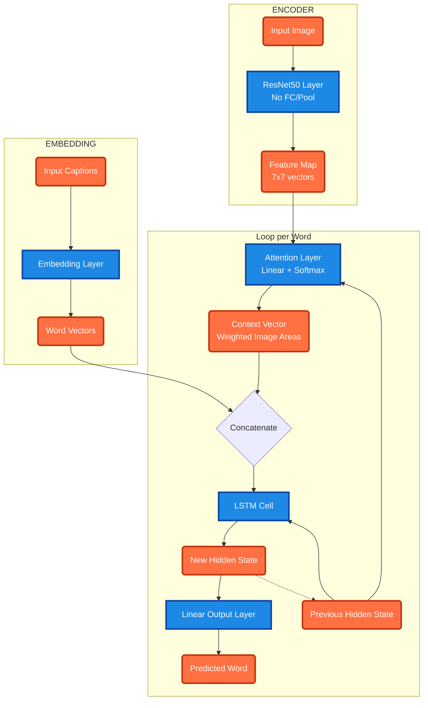

# Show, Attend and Tell on Flickr8k


A PyTorch implementation of **Show, Attend and Tell: Neural Image Caption Generation with Visual Attention** (Xu et al., ICML 2015). This project uses a **ResNet50** encoder and an **LSTM** decoder with **Bahdanau Attention** to generate descriptive captions for images in the **Flickr8k** dataset.

## Architecture

The model consists of three main components:
1.  **Encoder**: A pre-trained **ResNet50** (ImageNet) without the fully connected layers. It extracts spatial feature vectors `(7x7x2048)` from input images.
2.  **Attention**: A **Bahdanau (Additive) Attention** mechanism that computes a weighted sum of encoder features based on the decoder's current hidden state. This allows the model to "look" at specific parts of the image at each time step.
3.  **Decoder**: An **LSTM** network that takes the context vector (from attention) and previous word embedding to predict the next word in the sequence.


## Directory Structure

```
Show-Attend-and-Tell/
├── app/
│   └── main.py         # Streamlit Web App
├── data/               # Dataset files
├── models/             # Saved artifacts
│   ├── cnn_lstm/       # Checkpoints (default)
│   └── vocab.pkl       # Shared Vocabulary
├── src/                # Source code
│   ├── build_vocab.py  # Vocabulary generation script
│   ├── config.py       # Configuration and hyperparameters
│   ├── dataset.py      # Custom Dataset class
│   ├── download_data.py # Dataset downloader
│   ├── evaluate.py     # Evaluation script (BLEU scores)
│   ├── inference.py    # Inference script with Beam Search
│   ├── model.py        # CNN + LSTM Model (DecoderLSTM)
│   ├── train.py        # Training loop
│   ├── utils.py        # Utility functions
│   └── verify_setup.py # Environment verification script
├── Dockerfile          # Docker configuration
├── requirements.txt    # Project dependencies
├── run_docker.py       # Helper script for Docker deploy
└── README.md           # This documentation
```

## Getting Started

### Installation

1. **Clone the repository**:
   ```bash
   git clone https://github.com/Raditfiransah/Show-Attend-and-Tell.git
   cd Show-Attend-and-Tell
   ```

2. **Create a Virtual Environment** (Recommended):
   ```bash
   python -m venv venv
   source venv/bin/activate  # On Windows: venv\Scripts\activate
   ```

3. **Install Dependencies**:
   ```bash
   pip install -r requirements.txt
   ```

### 1. Data Preparation

First, download the dataset and ensure it is placed in the `data/` directory:

```bash
python src/download_data.py
```

Then, build the vocabulary:

```bash
python src/build_vocab.py
```
This will generate `models/vocab.pkl`.

### 2. Training

Train the CNN + LSTM model:

```bash
python src/train.py
```
Checkpoints will be saved to `models/cnn_lstm/` (or as configured in `src/config.py`).

### 3. Evaluation (BLEU Scores)

Evaluate the trained model on the validation set using BLEU-4 metrics. You can also optionally specify pretrained embeddings (e.g., GloVe) to load into the model during evaluation (or at initialization).

```bash
python src/evaluate.py --model_path models/cnn_lstm/best_model.pth --embedding_path glove.6B.200d.txt
```
*Note: Make sure your `EMBED_DIM` in `src/config.py` matches the dimension of the pretrained vectors if you are training with them or replacing them.*

### 4. Web Application 

We provide a **Streamlit** based web interface to easily interact with the trained models.

**Run Locally:**
```bash
python -m streamlit run app/main.py
```

**Run via Docker:**
We have provided a helper script to build and deploy the app container seamlessly.

```bash
python run_docker.py
```
This will build the image `vibe-reader-app` and launch it on `http://localhost:8501`.

### 5. CLI Inference

Generate captions for new images using the command line:

```bash
python src/inference.py --image path/to/image.jpg --beam_size 5
```

## Configuration

You can adjust hyperparameters in `src/config.py`:

- `BATCH_SIZE`: 64
- `EMBED_DIM`: 256
- `HIDDEN_DIM`: 512
- `ATTENTION_DIM`: 256
- `ENCODER_DIM`: 2048
- `LEARNING_RATE`: 1e-4

## License

MIT License.
